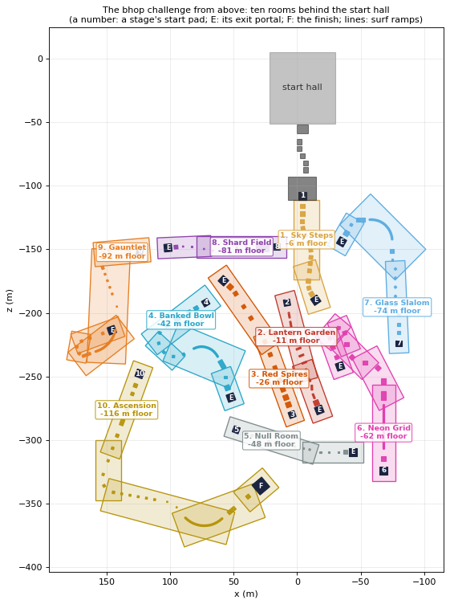

# VoidFlow bhop challenge

A 10 stage bunny hop map behind the start hall. Finish all ten stages to win **every karambit
and the Void gloves painted to match each** (nine of each). Among them is the **Karambit |
Velocity** and its matching **Void Gloves | Velocity**, a set you can't get any other way (not from
cases, gifts, or finishing the surf course). It's the set on show at the plaza, and it's equipped
when you finish.

It's an original design built around CS-style movement (Source physics, 64 tick, auto-hop,
air-accelerate 150). No layouts, names or assets were taken from existing maps. The look and the
spacing follow the classic CS:GO bhop maps (studied from a top 10 bhop maps video): every stage is
its own enclosed room, a corridor or hall with walls all round. The blocks stand up as pillars from
a floor a few metres below, each with a coloured cap, a classic hop apart. Touching the floor sends
you back to the stage's start.

## How to get there

- In the start hall, turn around: the back wall has a gold archway marked **BHOP CHALLENGE**.
- Through it: a terrace, then a **bhop trail** of five wide marble steps. Hold W and jump; you can
  hop them at running speed.
- The trail ends at the **plaza**. Low parapets run along its sides. At its far end is stage 1's
  wall, with the challenge's sign over a gold-framed doorway. The Velocity set turns on two
  pedestals either side of the doorway, and stage 1's pad is in the doorway.

## Rules and controls

| | |
|---|---|
| Start | Step onto the stage 1 pad. The clock starts when you hop off it |
| Checkpoints | Every stage's start pad is a checkpoint. Miss and you're back on the start pad of the stage you're on |
| A miss | Touching the room's floor, or dropping more than 4 m below the blocks around you |
| Exit portals | Each room ends in an exit pad under a gold arch filled with the next stage's light. Land on it and you're on the next room's start pad |
| T | Restart the stage you're on (from its start pad) |
| R | Back to stage 1 (the clock resets) |
| C | At the plaza: carry on from the furthest stage you've reached (it counts for the prize, not for a best time) |
| Finish | Land on the finish platform at the end of stage 10. Every karambit and its matching gloves go into your inventory (any you already have stay as they are), and the Velocity set is equipped; step into the ring to go back up |
| Noclip | Locked out here (a fast double tap of jump would otherwise switch it on mid-hop). Flying in from the hall makes the attempt practice, with nothing won |

The HUD shows the stage, the run's time, the stage's time, your best, your speed and your keys.

## The rooms

Each stage is a room of its own:

- **Walls** all round, 6 m above its highest block, with pilasters and a cornice. The rooms are
  open to the sky (the null room has a lit ceiling that lets the sun through), so the walls throw
  their shadows in.
- **A floor** 4 m under the lowest block. Touch it and you're back on the start pad.
- **The blocks**, standing up from the floor as pillars. Each has a cap in the room's colour, and
  some have a square set into the top or a glowing edge.
- **A start pad** up on its own pillar, with the stage's sign hanging over the first hop.
- **An exit portal** at the far end.

A room follows its stage's route. It's a chain of rectangular chambers, a new one wherever the
route turns more than 70 degrees or runs on 55 m, each just big enough round its stretch with the
walls 4.5 m out from the blocks. A straight stage gets a long corridor, a winding one a winding
room. The chambers share a floor and open into one another.

The rooms step down one below another, each a little lower than the last, gathered behind the hall
and placed so no two overlap (their walls at least 4 m apart). The surf course was checked against all of
it: built in full (all 116 stages), nothing of it comes within x -310 to 310, y -150 to 30, z -570
to -34. The floating islands of the hall's backdrop are kept out of it too.

## How the stages were designed

Each stage is designed as a **movement sequence**, not a list of blocks. Every hop states how it
should feel: how much its height changes, how much it turns, the size of the block it lands on, and
how hard it is. The block then goes where that hop comes down.

Like the classic bhop maps, **each stage holds a pace**: an expert keeps to the stage's cruising
speed (strafing less rather than gaining more), from 8 m/s (315 u/s) on the warm-up to 12 m/s
(470 u/s) on the long gaps. So the blocks sit a classic distance apart, 5 to 9 m between middles,
and the hard part is **holding your speed inside each block's window** while you turn, climb and
drop. A hop's difficulty is set as the speed it needs, as a share of that pace. Only the speed
stage, the long gaps and the ramps' exits run faster.

| Stage | Pace | Hops | Distance between blocks (shortest / average / longest) |
|---|---|---|---|
| 1. Sky Steps (a marble court over water) | 8 m/s (315 u/s) | 14 | 4.2 / 5.8 / 8.1 m |
| 2. Lantern Garden (a lantern garden over moss) | 8.5 m/s (335 u/s) | 13 | 4.4 / 6.6 / 8.1 m |
| 3. Red Spires (red spires over sand) | 12 m/s (472 u/s) | 13 | 5.7 / 8.9 / 12.1 m |
| 4. Banked Bowl (a white bowl over a pool) | 10.5 m/s (413 u/s) | 13 | 6.5 / 8.4 / 10.6 m |
| 5. Null Room (a clean grid room, lit ceiling) | 9 m/s (354 u/s) | 14 | 4.6 / 6.5 / 8.7 m |
| 6. Neon Grid (a neon grid) | 10 m/s (394 u/s) | 14 | 5.9 / 8.8 / 11.4 m |
| 7. Glass Slalom (glass over ice) | 10 m/s (394 u/s) | 14 | 6.1 / 7.6 / 9.1 m |
| 8. Shard Field (a crystal cave) | 9.5 m/s (374 u/s) | 12 | 4.8 / 6.9 / 9.5 m |
| 9. Gauntlet (basalt over lava) | 10.5 m/s (413 u/s) | 18 | 5.4 / 7.3 / 10.8 m |
| 10. Ascension (white and gold) | 11 m/s (433 u/s) | 20 | 6.6 / 9.5 / 17.0 m |

What shapes every jump, under the game's own physics:

- **With auto-hop, a hop's length is your speed times its airtime.** You can't hop short without
  braking, so the spacing of the blocks sets the speed you need, and the size of the block sets how
  far off it you may be. A 1.2 m block at 8 m/s leaves you a window of about 1 m/s.
- **Heights set the rhythm.** A step up shortens a hop (airtime 0.53 s for +1.2 m), a drop
  lengthens it (0.96 s for -2 m), at the same speed. Chains of up-steps punish any loss of speed.
- **Turning has a limit.** The tightest air turn at speed v has a radius of about v^2/49 m (2 m at
  10 m/s, 8 m at 20 m/s), so tight corners after fast sections force you to slow down first.
- **Too fast is as bad as too slow.** Gaining speed is easy, losing it is not. Players who know a
  stage hold their speed, and the narrow blocks punish anyone who doesn't.
- **Edges matter.** The player is a capsule: land with your middle near an edge and its round bottom
  catches it, taking most of your speed. Landing windows are measured with your middle at least
  0.2 m in from the edge.
- **Slopes boost, banks turn.** Landing on a downhill slope turns fall speed into forward speed;
  landing on a bank tilted into a turn takes away the outward drift.
- **Surf ramps carry momentum.** Hop onto the face, surf it round its curve, and fly off its end
  onto a strip. Exits come out a little low and slow, so each strip lies mostly behind where a
  perfect exit would land.

Every stage has several hard jumps followed by an easier one to recover and settle your speed again.

## Stage by stage

**1. Sky Steps** (warm-up). A marble court over still water: marble caps on ivory pillars with gold
collars. Wide steps (3 to 3.5 m), gentle curves each way, a first drop, a step up and a long jump
down 2 m. Teaches holding jump, sync strafing and holding a pace.

**2. Lantern Garden** (narrow platforms). Stone walls, red lacquered posts with paper lanterns,
moss below. Wooden planks 1.2 m wide: hold your line. Then three crosswise planks 1.2 to 1.3 m deep
at an even beat: hold your speed, too fast or too slow both miss. Then a slalom of planks turning 20
to 35 degrees each way.

**3. Red Spires** (long gaps). Sandstone walls and red sand far below terracotta towers. Four
wide tower tops to build speed on, a downhill of towers 1.5 m down each, and three long gaps (10 to
12 m) at 12 m/s.

**4. Banked Bowl** (curves and angled surfaces). A white bowl with cyan light in its walls, over a
pale pool. A slope boost, a banked 180 (five 2 m banks turning 36 degrees each), then a surf ramp
curving 90 degrees the other way onto a landing strip, and a 30 degree turn off it onto a 2.2 m
block.

**5. Null Room** (precision). A clean grid room under a lit ceiling: grey pillars with a white
square on top. Small blocks (2 m down to 1.1 m) where heights set the rhythm: up a metre, down one
and a half, up, down, offsets 25 degrees each way, then two tiny blocks.

**6. Neon Grid** (high speed). A black void ruled in pink and cyan light. A drop-in, then a straight
surf ramp to about 16 m/s, a run of 90 degree direction changes at that speed, a speed check, and a
hairpin of three 60 degree turns that you can only make under 10 m/s: slowing down is the skill.

**7. Glass Slalom** (advanced strafing). Glass over icy water between walls of ice. Alternating 80
degree left/right turns between 1.6 m blocks, then a surf ramp curving 90 degrees, a landing strip
and a 60 degree momentum transfer onto a 2 m block.

**8. Shard Field** (extreme precision). A crystal cave with glowing veins. A drop onto a wide
landing, then violet shards 1 to 1.2 m across: drops that build speed, two up-steps where you must
slow down or overshoot, a long gap onto a 1.2 m shard, and a 15 degree turn onto a 1 m one.

**9. Gauntlet** (everything). Basalt over lava. Narrow planks, three banks, a climb of four 1.2 m
up-steps onto 1.4 m blocks, tiny blocks, a surf ramp curving 60 degrees onto a plank, a hairpin you
must slow for, then a long gap at full pace. Almost nowhere to rest.

**10. Ascension** (mastery). White and gold, black-topped pillars. Two slope boosts into long gaps,
a fast 100 degree corner, the climb (five up-steps), tiny blocks, the final surf ramp curving 90
degrees, and the final jump: 17 m and 3 m down onto the finish's landing, about 15 m/s needed off the ramp.

## Playtest: is every jump possible, and how hard is it?

A bot played every stage with the game's own movement code (PlayerMovement.Simulate, 64 tick),
from each stage's start pad, in the room as built (walls, pillars, floor), like a bhop player. It
predicts where it will come down and strafes for speed while that's on the block. It turns toward
the block when it's off to one side and swings wider to spend spare speed rather than braking. Like
a player who knows the stage, it holds the speed the next two blocks allow and brakes early and
gently when it's over. On a surf ramp it presses into the face. Four players:

- **Perfect**: switches strafe side any tick, no error. Proves the jumps can be made.
- **Near-perfect**: switches every 2 ticks, a few centimetres of aim error. 12 runs.
- **Expert**: switches at most every 7 ticks (about 9 times a second), 2 degrees of aim error, a
  limited swing. 12 runs.
- **Good**: every 12 ticks, more error. 12 runs.

| Stage | Perfect | Near-perfect (12 runs) | Expert (12 runs) | Good (12 runs) | Where the expert falls |
|---|---|---|---|---|---|
| 1 Sky Steps | clears it (11.2s) | 12/12 (11.2s) | 12/12 (11.2s) | 4/12 (11.2s) | - |
| 2 Lantern Garden | clears it (10.5s) | 11/12 (10.5s) | 9/12 (10.5s) | 1/12 (11.3s) | hop 5 (2x), hop 9 (1x) |
| 3 Red Spires | clears it (11.7s) | 12/12 (11.7s) | 8/12 (11.7s) | 1/12 (11.7s) | hop 11 (2x), hop 12 (1x), hop 13 (1x) |
| 4 Banked Bowl | clears it (13.0s) | 12/12 (12.9s) | 7/12 (12.8s) | 0/12 | hop 13 (2x), hop 7 (1x), hop 9 (1x) |
| 5 Null Room | clears it (11.4s) | 12/12 (11.4s) | 5/12 (11.4s) | 0/12 | hop 10 (3x), hop 12 (2x), hop 11 (1x) |
| 6 Neon Grid | clears it (14.4s) | 12/12 (14.4s) | 2/12 (14.7s) | 1/12 (14.9s) | hop 9 (7x), hop 8 (2x), hop 5 (1x) |
| 7 Glass Slalom | clears it (13.8s) | 12/12 (13.8s) | 3/12 (13.7s) | 0/12 | hop 6 (3x), hop 14 (2x), hop 8 (2x) |
| 8 Shard Field | clears it (10.0s) | 11/12 (10.0s) | 3/12 (10.0s) | 0/12 | hop 5 (3x), hop 7 (2x), hop 6 (2x) |
| 9 Gauntlet | clears it (16.3s) | 12/12 (16.3s) | 3/12 (16.3s) | 0/12 | hop 11 (2x), hop 5 (2x), hop 15 (2x) |
| 10 Ascension | clears it (19.2s) | 12/12 (18.9s) | 2/12 (18.9s) | 0/12 | hop 4 (5x), hop 5 (2x), hop 17 (2x) |

Every stage was finished by the perfect bot, and by the near-perfect one in 11 or 12 runs of 12, so
none is impossible. The expert finishes stage 1 every time and the later stages less and less often,
down to 2 or 3 runs in 12 on the last four: they need near-perfect movement.

The playtest found and fixed, before release:

- The crosswise planks of stage 2 asked for 7 to 8.5 m/s straight after long planks that let you
  speed up to 11 m/s, with no way to brake that much in one hop. Now the stage is laid for its
  pace, and a player who holds it is fine.
- A pace-holding player braking for the finish platform before the final jump (it's 10 m long, so
  there's no need): the final jump needs all the ramp's speed.
- Stages 3 to 9 retuned until the difficulty climbs stage by stage (stage 3's long gaps eased a
  little; stage 4's banks narrowed to 2 m; stage 5's tiny blocks to 1.1 m; stage 7's slalom blocks
  to 1.6 m; stage 9's climb onto 1.4 m blocks at a faster pace).
- From the first version: landing near an edge killing your speed (every landing window keeps your
  middle 0.2 m in), blocks after surf ramps placed where a perfect exit would land (real exits land
  2 to 4 m short), and a curved final ramp too tight to hold.

## Every jump

What each hop asks, from the layout: its distance from the planned landing on the block before,
the height change, the turn (the strafe side that makes it), the airtime, the block's size (along
the route x across it), the speed it needs to reach the block (your middle 0.2 m in from the near
edge), the speed above which you must brake to stay on it, the stage's pace there (a perfect
strafer holding the stage's cruising speed), and what it asks of an expert (needed speed as a share
of the expert's pace: over 100% means better than that). Speeds in u/s (1 m/s = 39.4 u/s).

#### Stage 1: Sky Steps

| # | Piece | Distance | Height | Turn / strafe | Airtime | Landing (m) | Needs (u/s) | Brake above (u/s) | Pace | Asks of an expert |
|---|---|---|---|---|---|---|---|---|---|---|
| 1 | block (first hops) | 5.5 m | +0.0 m | sync (L/R) | 0.76 s | 3.5 x 3.5 | 208 | 370 | 283 | 75% |
| 2 | block | 6.0 m | +0.0 m | sync (L/R) | 0.76 s | 3.5 x 3.5 | 232 | 394 | 315 | 75% |
| 3 | block | 5.8 m | +0.0 m | sync (L/R) | 0.76 s | 3.0 x 3.0 | 236 | 372 | 315 | 75% |
| 4 | block (a gentle curve) | 5.8 m | +0.0 m | right 12° | 0.76 s | 3.0 x 3.0 | 236 | 372 | 315 | 75% |
| 5 | block | 5.8 m | +0.0 m | right 12° | 0.76 s | 3.0 x 3.0 | 236 | 372 | 315 | 75% |
| 6 | block (first drop) | 6.5 m | -1.0 m | sync (L/R) | 0.87 s | 3.0 x 3.0 | 236 | 354 | 315 | 75% |
| 7 | block | 5.8 m | +0.0 m | left 15° | 0.76 s | 3.0 x 3.0 | 236 | 372 | 315 | 75% |
| 8 | block | 5.8 m | +0.0 m | left 15° | 0.76 s | 3.0 x 3.0 | 236 | 372 | 315 | 75% |
| 9 | block (step up) | 4.8 m | +1.0 m | sync (L/R) | 0.59 s | 3.0 x 3.0 | 236 | 411 | 315 | 75% |
| 10 | block | 5.8 m | +0.0 m | sync (L/R) | 0.76 s | 3.0 x 3.0 | 236 | 372 | 315 | 75% |
| 11 | block (long jump) | 8.1 m | -2.0 m | sync (L/R) | 0.96 s | 3.5 x 3.5 | 268 | 395 | 315 | 85% |
| 12 | block | 5.5 m | +0.0 m | right 20° | 0.76 s | 3.0 x 3.0 | 220 | 356 | 315 | 70% |
| 13 | block | 5.2 m | +0.0 m | right 20° | 0.76 s | 3.5 x 3.5 | 189 | 351 | 315 | 60% |
| 14 | exit portal | 4.2 m | +0.0 m | sync (L/R) | 0.76 s | 6.0 x 6.0 | 157 | 283 | 315 | 50% |

#### Stage 2: Lantern Garden

| # | Piece | Distance | Height | Turn / strafe | Airtime | Landing (m) | Needs (u/s) | Brake above (u/s) | Pace | Asks of an expert |
|---|---|---|---|---|---|---|---|---|---|---|
| 1 | block (drop in: planks) | 8.1 m | -3.0 m | sync (L/R) | 1.04 s | 4.5 x 1.2 | 230 | 385 | 293 | 80% |
| 2 | block | 7.1 m | +0.0 m | sync (L/R) | 0.76 s | 4.5 x 1.2 | 263 | 477 | 335 | 80% |
| 3 | block | 7.2 m | +0.0 m | right 6° | 0.76 s | 4.5 x 1.2 | 268 | 481 | 335 | 80% |
| 4 | block | 7.2 m | +0.0 m | right 6° | 0.76 s | 4.5 x 1.2 | 268 | 481 | 335 | 80% |
| 5 | block (crosswise beat) | 5.9 m | +0.0 m | sync (L/R) | 0.76 s | 1.3 x 4.0 | 285 | 331 | 335 | 85% |
| 6 | block | 5.9 m | +0.0 m | sync (L/R) | 0.76 s | 1.3 x 4.0 | 285 | 331 | 335 | 85% |
| 7 | block | 6.0 m | +0.0 m | sync (L/R) | 0.76 s | 1.2 x 4.0 | 294 | 336 | 335 | 88% |
| 8 | block (plank slalom) | 6.9 m | +0.0 m | left 20° | 0.76 s | 4.0 x 1.3 | 268 | 456 | 335 | 80% |
| 9 | block | 6.9 m | +0.0 m | right 35° | 0.76 s | 4.0 x 1.3 | 268 | 456 | 335 | 80% |
| 10 | block | 6.9 m | +0.0 m | left 35° | 0.76 s | 4.0 x 1.3 | 268 | 456 | 335 | 80% |
| 11 | block | 6.9 m | +0.0 m | right 20° | 0.76 s | 4.0 x 1.3 | 268 | 456 | 335 | 80% |
| 12 | block (rest) | 5.7 m | +0.0 m | sync (L/R) | 0.76 s | 4.0 x 4.0 | 201 | 389 | 335 | 60% |
| 13 | exit portal | 4.4 m | +0.0 m | sync (L/R) | 0.76 s | 6.0 x 6.0 | 167 | 293 | 335 | 50% |

#### Stage 3: Red Spires

| # | Piece | Distance | Height | Turn / strafe | Airtime | Landing (m) | Needs (u/s) | Brake above (u/s) | Pace | Asks of an expert |
|---|---|---|---|---|---|---|---|---|---|---|
| 1 | block (drop in: build) | 6.3 m | -3.0 m | sync (L/R) | 1.04 s | 4.0 x 4.0 | 172 | 309 | 300 | 60% |
| 2 | block | 6.0 m | +0.0 m | sync (L/R) | 0.76 s | 4.0 x 4.0 | 221 | 409 | 349 | 65% |
| 3 | block | 6.7 m | +0.0 m | sync (L/R) | 0.76 s | 3.5 x 3.5 | 267 | 429 | 406 | 70% |
| 4 | block | 7.6 m | +0.0 m | sync (L/R) | 0.76 s | 3.5 x 3.5 | 315 | 476 | 453 | 75% |
| 5 | block (downhill) | 10.6 m | -1.5 m | sync (L/R) | 0.92 s | 3.0 x 3.0 | 400 | 512 | 472 | 88% |
| 6 | block | 11.0 m | -1.5 m | sync (L/R) | 0.92 s | 3.0 x 3.0 | 416 | 528 | 472 | 88% |
| 7 | block | 11.0 m | -1.5 m | right 6° | 0.92 s | 3.0 x 3.0 | 416 | 528 | 472 | 88% |
| 8 | block | 10.8 m | -1.5 m | right 6° | 0.92 s | 2.6 x 2.6 | 416 | 510 | 472 | 88% |
| 9 | block (long gap) | 10.8 m | -1.0 m | sync (L/R) | 0.87 s | 3.0 x 3.0 | 430 | 548 | 472 | 91% |
| 10 | block (long gap) | 10.7 m | -1.0 m | sync (L/R) | 0.87 s | 2.8 x 2.8 | 430 | 539 | 472 | 91% |
| 11 | block (max gap) | 12.1 m | -2.0 m | sync (L/R) | 0.96 s | 3.2 x 3.2 | 439 | 554 | 472 | 93% |
| 12 | block (rest) | 6.8 m | +0.0 m | right 15° | 0.76 s | 4.0 x 4.0 | 260 | 448 | 472 | 55% |
| 13 | exit portal | 5.7 m | +0.0 m | sync (L/R) | 0.76 s | 6.0 x 6.0 | 233 | 359 | 467 | 50% |

#### Stage 4: Banked Bowl

| # | Piece | Distance | Height | Turn / strafe | Airtime | Landing (m) | Needs (u/s) | Brake above (u/s) | Pace | Asks of an expert |
|---|---|---|---|---|---|---|---|---|---|---|
| 1 | block (drop in) | 6.8 m | -3.0 m | sync (L/R) | 1.04 s | 3.5 x 3.0 | 201 | 318 | 300 | 70% |
| 2 | block | 6.5 m | +0.0 m | sync (L/R) | 0.76 s | 3.5 x 3.0 | 259 | 421 | 358 | 75% |
| 3 | slope (slope boost) | 10.6 m | -2.0 m | sync (L/R) | 0.96 s | 4.5 x 3.5 | 351 | 519 | 401 | 90% |
| 4 | block | 9.5 m | -1.0 m | sync (L/R) | 0.87 s | 3.0 x 3.0 | 372 | 490 | 413 | 90% |
| 5 | bank (banked 180) | 8.3 m | +0.0 m | right 36° | 0.76 s | 2.0 x 2.0 | 393 | 476 | 413 | 95% |
| 6 | bank | 8.3 m | +0.0 m | right 36° | 0.76 s | 2.0 x 2.0 | 393 | 476 | 413 | 95% |
| 7 | bank | 8.3 m | +0.0 m | right 36° | 0.76 s | 2.0 x 2.0 | 393 | 476 | 413 | 95% |
| 8 | bank | 8.3 m | +0.0 m | right 36° | 0.76 s | 2.0 x 2.0 | 393 | 476 | 413 | 95% |
| 9 | bank | 8.3 m | +0.0 m | right 36° | 0.76 s | 2.0 x 2.0 | 393 | 476 | 413 | 95% |
| 10 | surf ramp (curved ramp) | 9.2 m onto it, then 22 m of ramp | -1.0 m | left 90° along the ramp | 0.87 s | its face | 372 | - | 413 | - |
| 11 | block (ramp to block) | 8.8 m | -2.5 m (fall) | sync (L/R) | 0.50 s | 7.0 x 3.5 | 441 | 964 | 587 | 75% |
| 12 | block | 10.5 m | +0.0 m | left 30° | 0.76 s | 2.2 x 2.2 | 499 | 593 | 587 | 85% |
| 13 | block (rest) | 8.6 m | +0.0 m | right 20° | 0.76 s | 4.0 x 4.0 | 352 | 540 | 587 | 60% |
| 14 | exit portal | 6.5 m | +0.0 m | sync (L/R) | 0.76 s | 6.0 x 6.0 | 278 | 403 | 556 | 50% |

#### Stage 5: Null Room

| # | Piece | Distance | Height | Turn / strafe | Airtime | Landing (m) | Needs (u/s) | Brake above (u/s) | Pace | Asks of an expert |
|---|---|---|---|---|---|---|---|---|---|---|
| 1 | block (drop in) | 6.1 m | -3.0 m | sync (L/R) | 1.04 s | 2.0 x 2.0 | 201 | 261 | 300 | 70% |
| 2 | block | 5.2 m | +0.0 m | sync (L/R) | 0.76 s | 1.8 x 1.8 | 236 | 309 | 305 | 80% |
| 3 | block (up) | 5.4 m | +1.0 m | sync (L/R) | 0.59 s | 1.6 x 1.6 | 322 | 403 | 336 | 96% |
| 4 | block (down) | 8.5 m | -1.5 m | sync (L/R) | 0.92 s | 1.6 x 1.6 | 340 | 391 | 354 | 96% |
| 5 | block | 5.6 m | +1.0 m | right 10° | 0.59 s | 1.5 x 1.5 | 340 | 414 | 354 | 96% |
| 6 | block | 8.5 m | -1.5 m | right 10° | 0.92 s | 1.5 x 1.5 | 340 | 387 | 354 | 96% |
| 7 | block (offsets) | 7.0 m | +0.0 m | left 25° | 0.76 s | 1.4 x 1.4 | 340 | 392 | 354 | 96% |
| 8 | block | 7.0 m | +0.0 m | right 25° | 0.76 s | 1.4 x 1.4 | 340 | 392 | 354 | 96% |
| 9 | block | 5.1 m | +1.2 m | left 25° | 0.53 s | 1.3 x 1.3 | 340 | 407 | 354 | 96% |
| 10 | block | 8.7 m | -2.0 m | right 25° | 0.96 s | 1.3 x 1.3 | 340 | 377 | 354 | 96% |
| 11 | block (tiny) | 6.6 m | +0.0 m | sync (L/R) | 0.76 s | 1.1 x 1.1 | 326 | 363 | 354 | 92% |
| 12 | block | 7.5 m | -1.0 m | sync (L/R) | 0.87 s | 1.1 x 1.1 | 326 | 358 | 354 | 92% |
| 13 | block (rest) | 5.4 m | +0.0 m | sync (L/R) | 0.76 s | 3.0 x 3.0 | 213 | 348 | 354 | 60% |
| 14 | exit portal | 4.6 m | +0.0 m | sync (L/R) | 0.76 s | 6.0 x 6.0 | 177 | 302 | 354 | 50% |

#### Stage 6: Neon Grid

| # | Piece | Distance | Height | Turn / strafe | Airtime | Landing (m) | Needs (u/s) | Brake above (u/s) | Pace | Asks of an expert |
|---|---|---|---|---|---|---|---|---|---|---|
| 1 | block (drop in) | 7.1 m | -3.0 m | sync (L/R) | 1.04 s | 4.0 x 4.0 | 201 | 337 | 300 | 70% |
| 2 | surf ramp (speed ramp) | 7.9 m onto it, then 34 m of ramp | -1.0 m | sync (L/R) along the ramp | 0.87 s | its face | 314 | - | 370 | - |
| 3 | block (off the ramp) | 9.4 m | -2.5 m (fall) | sync (L/R) | 0.50 s | 7.0 x 3.5 | 488 | 1012 | 622 | 80% |
| 4 | block | 11.2 m | +0.0 m | sync (L/R) | 0.76 s | 4.0 x 4.0 | 488 | 676 | 622 | 80% |
| 5 | block (90 at speed) | 11.4 m | +0.0 m | right 45° | 0.76 s | 3.5 x 3.5 | 512 | 674 | 622 | 84% |
| 6 | block | 11.4 m | +0.0 m | right 45° | 0.76 s | 3.5 x 3.5 | 512 | 674 | 622 | 84% |
| 7 | block | 11.4 m | +0.0 m | left 45° | 0.76 s | 3.5 x 3.5 | 512 | 674 | 622 | 84% |
| 8 | block | 11.4 m | +0.0 m | left 45° | 0.76 s | 3.5 x 3.5 | 512 | 674 | 622 | 84% |
| 9 | block (check your speed) | 9.0 m | +0.0 m | right 20° | 0.76 s | 3.0 x 3.0 | 402 | 537 | 622 | 66% |
| 10 | block (hairpin: slow down) | 6.5 m | +0.0 m | right 60° | 0.76 s | 2.5 x 2.5 | 284 | 394 | 553 | 51% |
| 11 | block | 6.5 m | +0.0 m | right 60° | 0.76 s | 2.5 x 2.5 | 284 | 394 | 406 | 70% |
| 12 | block | 6.5 m | +0.0 m | right 60° | 0.76 s | 2.5 x 2.5 | 284 | 394 | 406 | 70% |
| 13 | block (rebuild) | 7.5 m | +0.0 m | sync (L/R) | 0.76 s | 3.0 x 3.0 | 324 | 460 | 406 | 80% |
| 14 | block | 8.3 m | +0.0 m | sync (L/R) | 0.76 s | 3.0 x 3.0 | 365 | 500 | 406 | 90% |
| 15 | exit portal | 5.9 m | +0.0 m | sync (L/R) | 0.76 s | 6.0 x 6.0 | 243 | 369 | 406 | 60% |

#### Stage 7: Glass Slalom

| # | Piece | Distance | Height | Turn / strafe | Airtime | Landing (m) | Needs (u/s) | Brake above (u/s) | Pace | Asks of an expert |
|---|---|---|---|---|---|---|---|---|---|---|
| 1 | block (drop in) | 6.6 m | -3.0 m | sync (L/R) | 1.04 s | 3.0 x 3.0 | 201 | 299 | 300 | 70% |
| 2 | block | 6.4 m | +0.0 m | sync (L/R) | 0.76 s | 3.0 x 3.0 | 265 | 400 | 340 | 80% |
| 3 | block | 7.9 m | +0.0 m | sync (L/R) | 0.76 s | 2.5 x 2.5 | 355 | 465 | 383 | 95% |
| 4 | block (slalom) | 7.8 m | +0.0 m | right 40° | 0.76 s | 1.6 x 1.6 | 374 | 437 | 394 | 95% |
| 5 | block | 7.8 m | +0.0 m | left 80° | 0.76 s | 1.6 x 1.6 | 374 | 437 | 394 | 95% |
| 6 | block | 7.8 m | +0.0 m | right 80° | 0.76 s | 1.6 x 1.6 | 374 | 437 | 394 | 95% |
| 7 | block | 7.8 m | +0.0 m | left 80° | 0.76 s | 1.6 x 1.6 | 374 | 437 | 394 | 95% |
| 8 | block | 7.8 m | +0.0 m | right 80° | 0.76 s | 1.6 x 1.6 | 374 | 437 | 394 | 95% |
| 9 | block | 7.8 m | +0.0 m | left 40° | 0.76 s | 1.6 x 1.6 | 374 | 437 | 394 | 95% |
| 10 | block | 7.0 m | +0.0 m | sync (L/R) | 0.76 s | 3.0 x 3.0 | 295 | 431 | 394 | 75% |
| 11 | surf ramp (curved ramp) | 9.2 m onto it, then 26 m of ramp | -1.0 m | right 90° along the ramp | 0.87 s | its face | 374 | - | 394 | - |
| 12 | block (ramp to platform) | 9.1 m | -2.5 m (fall) | sync (L/R) | 0.50 s | 7.0 x 3.0 | 459 | 983 | 574 | 80% |
| 13 | block (momentum transfer) | 8.7 m | +0.0 m | right 60° | 0.76 s | 2.0 x 2.0 | 413 | 496 | 574 | 72% |
| 14 | block (rest) | 7.7 m | +0.0 m | sync (L/R) | 0.76 s | 4.0 x 4.0 | 307 | 494 | 511 | 60% |
| 15 | exit portal | 6.1 m | +0.0 m | sync (L/R) | 0.76 s | 6.0 x 6.0 | 255 | 380 | 509 | 50% |

#### Stage 8: Shard Field

| # | Piece | Distance | Height | Turn / strafe | Airtime | Landing (m) | Needs (u/s) | Brake above (u/s) | Pace | Asks of an expert |
|---|---|---|---|---|---|---|---|---|---|---|
| 1 | wide landing (drop in: a wide landing) | 6.3 m | -3.0 m | sync (L/R) | 1.04 s | 10.0 x 7.0 | 172 | 309 | 300 | 60% |
| 2 | block (shards) | 8.0 m | -1.0 m | sync (L/R) | 0.87 s | 1.2 x 1.2 | 343 | 380 | 346 | 100% |
| 3 | block | 8.1 m | -1.0 m | sync (L/R) | 0.87 s | 1.1 x 1.1 | 353 | 385 | 374 | 95% |
| 4 | block | 7.1 m | +0.0 m | right 10° | 0.76 s | 1.0 x 1.0 | 356 | 387 | 374 | 95% |
| 5 | block (drop) | 9.0 m | -2.0 m | sync (L/R) | 0.96 s | 1.0 x 1.0 | 356 | 380 | 374 | 95% |
| 6 | block (slow down) | 5.0 m | +1.2 m | sync (L/R) | 0.53 s | 1.0 x 1.0 | 347 | 391 | 374 | 93% |
| 7 | block | 5.2 m | +1.2 m | left 20° | 0.53 s | 1.0 x 1.0 | 361 | 406 | 374 | 97% |
| 8 | block | 7.1 m | +0.0 m | sync (L/R) | 0.76 s | 1.0 x 1.0 | 356 | 387 | 374 | 95% |
| 9 | block (long gap) | 9.5 m | -2.0 m | sync (L/R) | 0.96 s | 1.2 x 1.2 | 374 | 407 | 374 | 100% |
| 10 | block | 7.1 m | +0.0 m | right 15° | 0.76 s | 1.0 x 1.0 | 356 | 387 | 374 | 95% |
| 11 | block (rest) | 5.6 m | +0.0 m | sync (L/R) | 0.76 s | 3.0 x 3.0 | 224 | 360 | 374 | 60% |
| 12 | exit portal | 4.8 m | +0.0 m | sync (L/R) | 0.76 s | 6.0 x 6.0 | 186 | 311 | 372 | 50% |

#### Stage 9: Gauntlet

| # | Piece | Distance | Height | Turn / strafe | Airtime | Landing (m) | Needs (u/s) | Brake above (u/s) | Pace | Asks of an expert |
|---|---|---|---|---|---|---|---|---|---|---|
| 1 | block (drop in: planks) | 7.5 m | -3.0 m | sync (L/R) | 1.04 s | 4.0 x 1.0 | 215 | 352 | 300 | 75% |
| 2 | block | 7.4 m | +0.0 m | sync (L/R) | 0.76 s | 4.0 x 1.0 | 294 | 481 | 379 | 85% |
| 3 | bank (banks) | 7.7 m | +0.0 m | right 40° | 0.76 s | 2.5 x 2.0 | 348 | 458 | 410 | 90% |
| 4 | bank | 8.1 m | +0.0 m | right 40° | 0.76 s | 2.5 x 2.0 | 369 | 478 | 413 | 90% |
| 5 | bank | 8.2 m | +0.0 m | right 40° | 0.76 s | 2.5 x 2.0 | 372 | 481 | 413 | 90% |
| 6 | block (climb) | 5.4 m | +1.2 m | sync (L/R) | 0.53 s | 1.4 x 1.4 | 364 | 437 | 413 | 88% |
| 7 | block | 5.4 m | +1.2 m | sync (L/R) | 0.53 s | 1.4 x 1.4 | 364 | 437 | 413 | 88% |
| 8 | block | 5.5 m | +1.2 m | sync (L/R) | 0.53 s | 1.4 x 1.4 | 372 | 446 | 413 | 90% |
| 9 | block | 5.5 m | +1.2 m | sync (L/R) | 0.53 s | 1.4 x 1.4 | 372 | 446 | 413 | 90% |
| 10 | block (tiny) | 10.6 m | -2.0 m | sync (L/R) | 0.96 s | 1.0 x 1.0 | 422 | 446 | 413 | 102% |
| 11 | block | 8.4 m | +0.0 m | left 30° | 0.76 s | 1.0 x 1.0 | 422 | 453 | 413 | 102% |
| 12 | surf ramp (ramp) | 10.3 m onto it, then 24 m of ramp | -1.0 m | left 60° along the ramp | 0.87 s | its face | 422 | - | 413 | - |
| 13 | block (ramp to plank) | 9.6 m | -2.5 m (fall) | sync (L/R) | 0.50 s | 7.0 x 2.0 | 499 | 1023 | 587 | 85% |
| 14 | block (hairpin) | 6.0 m | +0.0 m | left 60° | 0.76 s | 2.0 x 2.0 | 271 | 355 | 587 | 46% |
| 15 | block | 6.0 m | +0.0 m | left 60° | 0.76 s | 2.0 x 2.0 | 271 | 355 | 389 | 70% |
| 16 | block | 6.0 m | +0.0 m | left 60° | 0.76 s | 2.0 x 2.0 | 271 | 355 | 389 | 70% |
| 17 | block | 7.1 m | +0.0 m | sync (L/R) | 0.76 s | 2.0 x 2.0 | 327 | 411 | 389 | 85% |
| 18 | block (max gap) | 10.8 m | -2.0 m | sync (L/R) | 0.96 s | 2.0 x 2.0 | 409 | 474 | 413 | 100% |
| 19 | exit portal | 6.0 m | +0.0 m | sync (L/R) | 0.76 s | 6.0 x 6.0 | 248 | 373 | 413 | 60% |

#### Stage 10: Ascension

| # | Piece | Distance | Height | Turn / strafe | Airtime | Landing (m) | Needs (u/s) | Brake above (u/s) | Pace | Asks of an expert |
|---|---|---|---|---|---|---|---|---|---|---|
| 1 | block (drop in) | 7.4 m | -3.0 m | sync (L/R) | 1.04 s | 3.0 x 3.0 | 230 | 328 | 300 | 80% |
| 2 | block | 7.0 m | +0.0 m | sync (L/R) | 0.76 s | 2.5 x 2.5 | 311 | 420 | 367 | 90% |
| 3 | slope (slope boosts) | 11.5 m | -2.5 m | sync (L/R) | 1.00 s | 5.0 x 3.0 | 361 | 543 | 415 | 92% |
| 4 | slope | 12.3 m | -2.5 m | sync (L/R) | 1.00 s | 5.0 x 3.0 | 392 | 573 | 433 | 92% |
| 5 | block | 11.2 m | -2.5 m | sync (L/R) | 1.00 s | 2.5 x 2.5 | 398 | 481 | 433 | 92% |
| 6 | block (max speed) | 10.5 m | -1.0 m | sync (L/R) | 0.87 s | 2.0 x 2.0 | 442 | 514 | 433 | 102% |
| 7 | block | 10.4 m | -1.0 m | sync (L/R) | 0.87 s | 1.8 x 1.8 | 442 | 505 | 433 | 102% |
| 8 | block | 11.5 m | -2.0 m | sync (L/R) | 0.96 s | 1.8 x 1.8 | 442 | 499 | 433 | 102% |
| 9 | block (fast corner) | 9.3 m | +0.0 m | right 50° | 0.76 s | 2.0 x 2.0 | 442 | 525 | 433 | 102% |
| 10 | block | 9.3 m | +0.0 m | right 50° | 0.76 s | 2.0 x 2.0 | 442 | 525 | 433 | 102% |
| 11 | block (the climb) | 6.6 m | +1.2 m | sync (L/R) | 0.53 s | 1.6 x 1.6 | 442 | 530 | 433 | 102% |
| 12 | block | 6.6 m | +1.2 m | sync (L/R) | 0.53 s | 1.6 x 1.6 | 442 | 530 | 433 | 102% |
| 13 | block | 6.6 m | +1.2 m | sync (L/R) | 0.53 s | 1.6 x 1.6 | 442 | 530 | 433 | 102% |
| 14 | block | 6.6 m | +1.2 m | sync (L/R) | 0.53 s | 1.6 x 1.6 | 442 | 530 | 433 | 102% |
| 15 | block | 6.6 m | +1.2 m | sync (L/R) | 0.53 s | 1.6 x 1.6 | 442 | 530 | 433 | 102% |
| 16 | block (tiny) | 10.0 m | -1.0 m | sync (L/R) | 0.87 s | 1.0 x 1.0 | 442 | 469 | 433 | 102% |
| 17 | block | 8.8 m | +0.0 m | left 40° | 0.76 s | 1.0 x 1.0 | 442 | 473 | 433 | 102% |
| 18 | surf ramp (final ramp) | 10.7 m onto it, then 32 m of ramp | -1.0 m | right 90° along the ramp | 0.87 s | its face | 442 | - | 433 | - |
| 19 | block (ramp to plank) | 11.6 m | -2.5 m (fall) | sync (L/R) | 0.50 s | 7.0 x 3.0 | 658 | 1182 | 731 | 90% |
| 20 | block (final jump) | 17.0 m | -3.0 m | sync (L/R) | 1.04 s | 3.0 x 3.0 | 595 | 693 | 731 | 81% |
| 21 | finish | 9.4 m | +0.0 m | sync (L/R) | 0.76 s | 10.0 x 10.0 | 428 | 554 | 714 | 60% |

