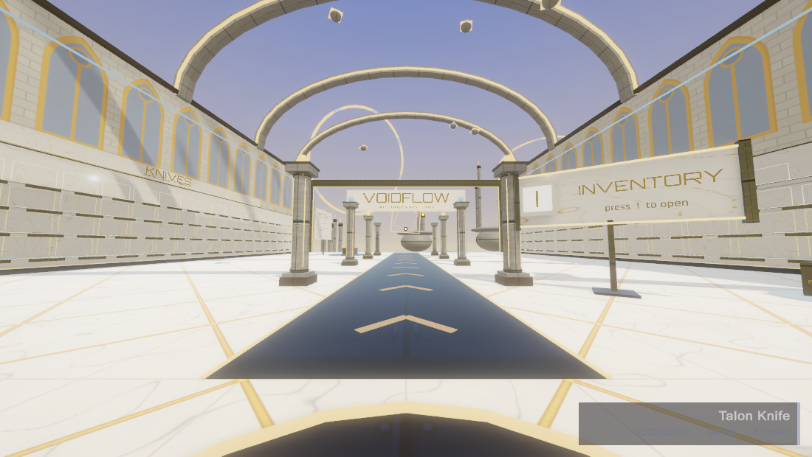

# VoidFlow

**A CS-style surf game I made for fun, vibe coding on the side. Nothing too serious, just a little game for anyone checking out my portfolio to jump in and try.**

**[Play it in your browser](https://ahmedwalidbarakat.github.io/VoidFlow/)** (desktop with a keyboard and mouse, it takes a few seconds to load)

## What it is

I grew up on CS surf maps, so I made my own take on it. You drop off a start terrace and surf one fixed course of 354 ramps through 59 zones, with a checkpoint at the start of each zone and a finish at the end. The last 27 zones are the Legend stretch, built to be as hard as the toughest surf maps. Movement is tuned to feel like classic Source surf (air strafing, ramp sliding, the whole thing).

Along the way you grab Void Shards, which earn Void Cases, which drop knives, gloves and snipers with their own inspect animations. Your items and your last checkpoint are saved in the browser, so you can come back to them.

## Controls

| Key | Action |
| --- | --- |
| WASD | Move (on ramps, hold A or D toward the ramp and steer with the mouse) |
| Space | Jump (hold to bhop) |
| 1 / 2 / Q | Sniper, knife, last weapon |
| Click / Right click | Fire / scope |
| F | Inspect |
| I | Inventory |
| E | Use |
| C | Continue from your last checkpoint (in the start area) |
| R | Restart the run |
| Esc | Release the mouse |

## Built with

- Unity 6 (URP), C#, built for WebGL
- Everything in the game is procedurally generated in code: the course, the zones, the weapons and their skins
- Free CC0 assets: arm model from [Quaternius](https://quaternius.com), leather, fabric and stone textures from [ambientCG](https://ambientcg.com), particle sprites from [Kenney](https://kenney.nl)

## License

MIT for the code. The CC0 assets are public domain; their license files are in the project next to them.
